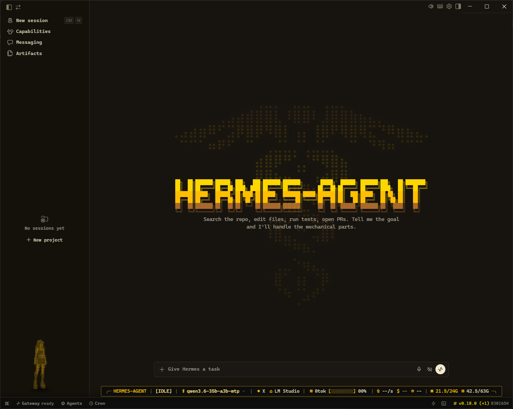
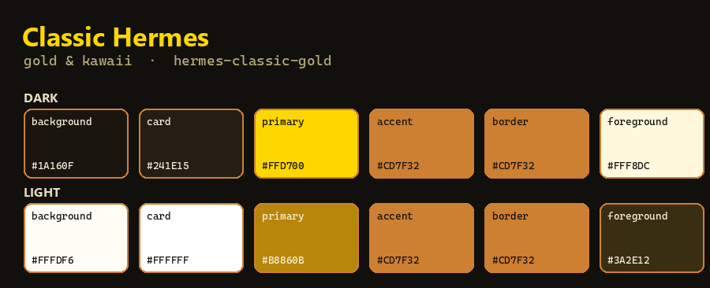
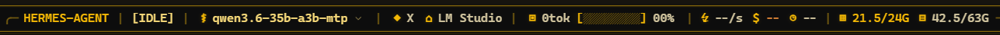
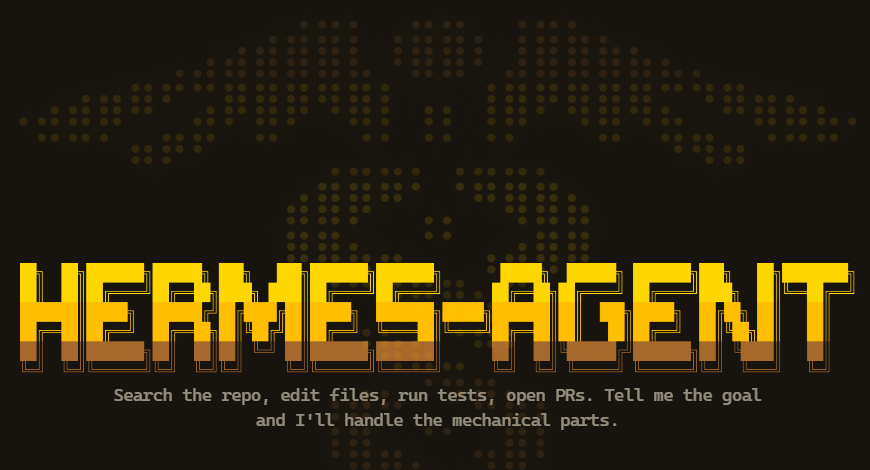
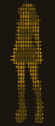

# 🪙 Hermes Classic Gold Pack

> A warm **gold makeover** for the [Hermes agent](https://github.com/NousResearch/hermes-agent) desktop app — theme, pets, status bar, and background.

[](https://github.com/Elevatormusic/hermes-classic-gold-pack/releases)
[](LICENSE)




**What is this?** A cosmetic pack for Hermes Desktop: a gold **theme**, two animated
**pets**, an optional **status bar**, and an optional **caduceus background**. The
theme and pets take about 30 seconds; the status bar and background are optional extras.

---

## ⚡ Quick start

> **The easy way** — paste the prompt below into an AI coding assistant that can run
> commands on your computer (**Claude Code**, **Cursor**, or **Codex CLI**). It fetches
> everything and installs it for you. Nothing else to download.

```text
You have shell + file access. Install the Hermes "Classic Gold" pack: clone
https://github.com/Elevatormusic/hermes-classic-gold-pack, then open ai/install.md
inside it and follow those steps exactly.
```

That's it. The assistant installs the theme + pets, then asks if you also want the
status bar and background. Prefer to do it by hand? See **Install** below.

---

## 🖼️ What's inside

The screenshot above is the real desktop with **everything applied**. Here's each
piece on its own.

### 🎨 Theme — gold & kawaii



The `hermes-classic-gold` desktop theme — warm gold borders, cornsilk text, in
both **light and dark**. Installs via a one-time DevTools console paste
(localStorage), so it needs no rebuild and works on any Hermes version.

### 📊 Status bar — TelemetryTape HUD



A compact heads-up display along the bottom edge. Left → right:

- **workspace** (`HERMES-AGENT`) · **agent state** (`[IDLE]`)
- **active model** (`qwen3.6-35b-a3b-mtp ⌄`) · **reasoning effort** (`◆`) · **provider** (`⌂ LM Studio`)
- **tokens + context-usage bar** (`0tok [▨▨] 00%`)
- **throughput** (`⚡ --/s`) · **cost** (`$ --`) · **turn timer** (`⊙ --`)
- **live system resources** — GPU **VRAM** (`21.5/24G`) and system **RAM** (`42.5/63G`)

This is an *advanced* piece (a source patch + rebuild — see [`advanced/`](advanced/README.md)).

### 🌀 Background & loader — caduceus



The optional *caduceus extras*: a dotted-caduceus **backdrop** filling the empty
state behind the gold "HERMES-AGENT" wordmark, plus a caduceus **loader** — two
entwined sine-snakes that animate as a gold particle trail while Hermes is working
(replacing the stock rose-curve spinner). Advanced piece.

### 🐾 Pets — Noir Neko

<p>
  
  &nbsp;&nbsp;&nbsp;
  
</p>

<sub>Left: <b>Noir Neko</b>. Right: <b>Noir Neko ASCII Fine</b>. (Idle animations, shown on the theme's dark background.) Installed by <code>node install.mjs</code>.</sub>

---

## 📥 Install

**AI-assisted (recommended)** — use the **Quick start** prompt above. It installs
the theme + pets, then offers the advanced status bar and background.

<details>
<summary><b>Install by hand (theme + pets)</b></summary>

```bash
git clone https://github.com/Elevatormusic/hermes-classic-gold-pack
cd hermes-classic-gold-pack
node install.mjs --activate noir-neko-ascii-fine
```

- `--activate <slug>` sets that pet active (`noir-neko` or `noir-neko-ascii-fine`).
  Omit it to install both pets without changing your current pet.
- `--home <path>` points at a specific `HERMES_HOME` (the folder with `config.yaml`);
  otherwise it's detected automatically.

Then install the **theme** (one manual step — there's no theme-import API): open
Hermes Desktop → `Ctrl/Cmd+Shift+I` → **Console** tab → paste the contents of
[`theme/install-theme.js`](theme/install-theme.js) → Enter. Restart Hermes.
</details>

---

## 🗑️ Uninstall

Paste this into your AI assistant — it asks which parts to remove, then removes them:

```text
You have shell + file access. Uninstall the Hermes "Classic Gold" pack: open
https://github.com/Elevatormusic/hermes-classic-gold-pack (clone it if needed),
read ai/uninstall.md, ask me which parts to remove, then follow it.
```

<details>
<summary><b>Uninstall by hand</b></summary>

- **Theme** — open Hermes → Appearance → pick another theme, or in the DevTools
  console: `localStorage.setItem('hermes-desktop-theme-v2','nous');location.reload()`.
- **Pets** — delete `HERMES_HOME/pets/noir-neko` and `.../noir-neko-ascii-fine`.
  Don't use the in-app "remove" on an adopted pet — just delete the folder. Restore
  your previous pet from `config.yaml.bak` if needed.
- **Status bar / background** — restore the `*.orig` backups the apply scripts made,
  then `cd apps/desktop && npm run pack` (Hermes quit).

Full details: [`ai/uninstall.md`](ai/uninstall.md).
</details>

---

## 🐞 Report a problem

Paste this into your AI assistant — it collects diagnostics and hands you a
ready-to-submit GitHub issue link (you review before sending):

```text
You have shell + file access. Something in the Hermes "Classic Gold" pack isn't
working. In https://github.com/Elevatormusic/hermes-classic-gold-pack, read
ai/issuereport.md and follow it: gather diagnostics and give me a pre-filled
GitHub issue link to review before I submit.
```

Doing it yourself? Run `node scripts/diagnostics.mjs --logs` and open the link it
prints, or use **Issues → New → "Install failure"**. The issue only includes your
OS, Node version, and Hermes commit.

---

## 🔧 Advanced — status bar & caduceus background

The status bar and background edit Hermes' source code and rebuild the app, so
they're a separate tier. The AI installer handles them for you; to do it by hand,
see [`advanced/README.md`](advanced/README.md).

> **Heads-up:** the advanced pieces need a Hermes desktop **dev environment**
> (`apps/desktop` with dependencies installed), Hermes must be **fully quit** for
> the rebuild, and a **Hermes app update reverts them** (just re-run the installer).
> Patches target `NousResearch/hermes-agent@8301654`; on other versions the AI
> reconciles them via [`ai/repair.md`](ai/repair.md).

---

## ❓ Requirements & jargon

- **Hermes** installed. The pack finds your **HERMES_HOME** (the folder holding
  `config.yaml`) automatically.
- **Node.js** to run the installer — it ships with Hermes, so you already have it.
- **"Agentic assistant"** = an AI that can run commands and edit files on your
  machine (Claude Code, Cursor, Codex CLI). A plain chatbot can't do the install.
- **"DevTools console"** = the developer panel inside Hermes, opened with
  `Ctrl/Cmd+Shift+I` → **Console** tab.
- Advanced tier only: a Hermes desktop **dev environment** + Git.

> **Scope:** targets the Hermes *desktop* app. The installer is cross-platform
> (Windows/macOS/Linux) but verified on Windows; other OSes are best-effort —
> issues and PRs welcome.

---

## 📜 Credits & license

Theme, pets, and status bar by **Shaya (Elevatormusic)**. Built for the Hermes
agent by Nous Research. Released under the [MIT License](LICENSE).
