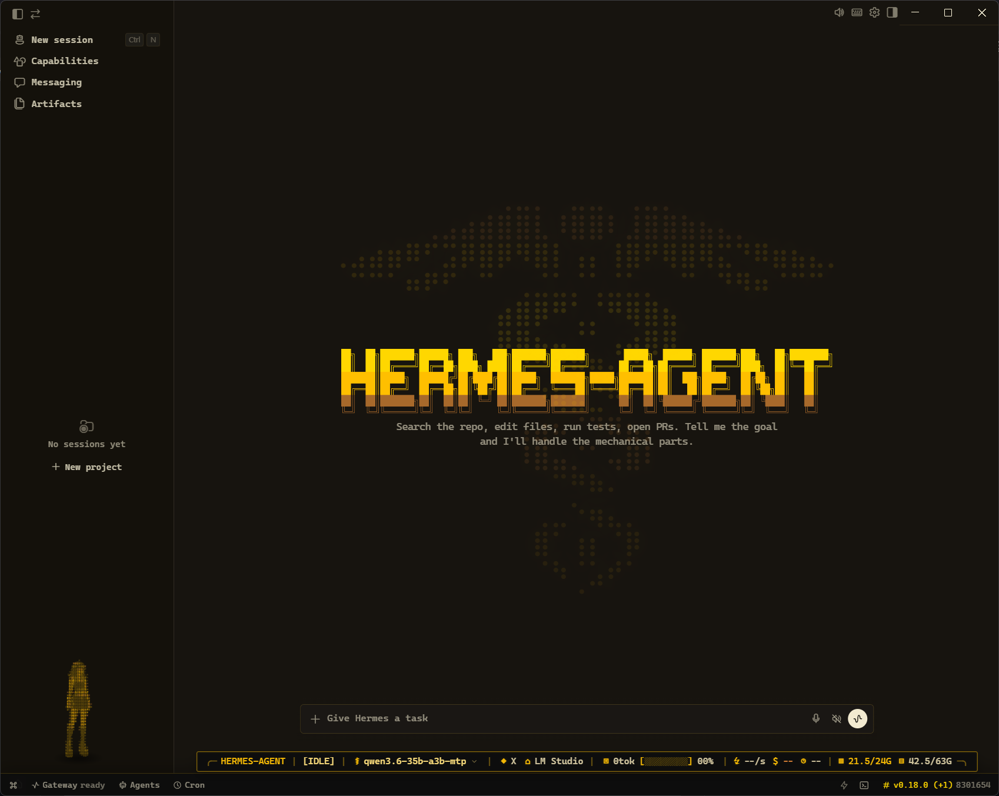
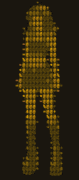

# Hermes-Agent Classic Gold Pack

> An update-safe gold theme, caduceus background, telemetry tape, and two Noir
> Neko pets for [Hermes Agent](https://github.com/NousResearch/hermes-agent).



## Run-time architecture

The recommended install puts a renderer plug-in and a small telemetry backend
under one Hermes profile:

```text
HERMES_HOME/
|-- desktop-plugins/classic-gold/plugin.js
`-- plugins/classic-gold/dashboard/
    |-- manifest.json
    |-- plugin_api.py
    `-- dist/index.js
```

The renderer uses the public Hermes plug-in SDK. It contributes the `Classic
Hermes` light and dark theme, a caduceus background, a pixel wordmark, an
interactive telemetry tape, and a settings page. It also contributes model,
reasoning, provider, and context controls.

This install does not change the Hermes git checkout. It does not patch
Electron, and it does not need `npm run pack`. The files remain outside the
checkout during a normal Hermes update.

## Select the target first

`HERMES_HOME` is the directory that contains the target `config.yaml`. Use an
explicit path for install, update, migration, and removal commands:

```bash
node install.mjs --dry-run --home "<HERMES_HOME>"
```

The installer can detect one profile. If it detects more than one profile, it
always refuses to select one. Prefer `--home` because it names the target. With
one detected profile, `--yes` can skip an interactive confirmation. It cannot
select between profiles. Migration and removal also require `--yes` for a
non-interactive write, after you review the dry run.

`--repo` means the Hermes Agent git checkout. It is needed only for a guarded
Hermes update or for removal of a legacy source patch. Do not use an
auto-detected checkout when more than one checkout can match.

## Install

```bash
git clone https://github.com/Elevatormusic/hermes-classic-gold-pack
cd hermes-classic-gold-pack
node install.mjs --dry-run --home "<HERMES_HOME>" --activate noir-neko-ascii-fine
node install.mjs --home "<HERMES_HOME>" --activate noir-neko-ascii-fine
```

Omit `--activate` to copy both pets without a pet-selection change. For a local
profile, `--no-desktop-plugin` skips the renderer and its default backend. The
remote-backend section uses explicit component flags. Do not combine the
source-patch path. The installer refuses the retired `--advanced` option.

The installer writes the renderer, the backend files, both bundled pet
directories, and these records:

- `HERMES_HOME/hermes-classic-gold-pack.json`;
- `HERMES_HOME/hermes-classic-gold-pack.manifest.json`.

It also changes only the `classic-gold` plug-in membership in `config.yaml`. If
you use `--activate`, it changes only the `display.pet` block. See
[`SECURITY.md`](SECURITY.md) for backup and removal limits.

Fully quit and start Hermes Desktop after the install. A renderer reload can
load the renderer file, but it cannot mount a new Python backend route. If the
renderer does not appear after the full restart, run **Reload desktop plugins**
from the Command Palette. Select **Classic Hermes** in **Settings > Appearance**
if another theme is active.

### First-start check

Use the repository screenshot as the visual reference. On the first start:

1. Capture one full-window screenshot before you change the window size.
2. Confirm the gold palette, caduceus, pixel wordmark, pet, and tape.
3. Confirm that **Classic Gold** is enabled in **Settings > Plugins** and that
   **Classic Hermes** is available in **Settings > Appearance**.
4. Click **HERMES-AGENT**. Change one setting, close the quick customizer, open
   **Customize Classic Gold** from the Command Palette, and confirm that the
   value stayed set.
5. In an active session, open the model and reasoning menus. Open the provider
   settings and the context breakdown.
6. Confirm that an active session hides the duplicate composer model selector.
   Confirm that a new draft keeps the selector.
7. Complete one turn. Check the token values, prompt-cache hit rate, final-turn
   rate, session cost, RAM, and VRAM. An unknown value can be correct; see the
   telemetry rules below.
8. Capture a second screenshot with the tape and one open control. If a check
   fails, include both screenshots in the issue report.

## Telemetry limits

The tape does not invent missing values.

- Speed is `--/s` while a turn runs. After completion, it is output tokens
  divided by the full turn time. It is not live decoder throughput.
- Cost is the actual provider-reported session cost when Hermes records
  `actual`. It is `0.00` when Hermes records an included subscription route. It
  is `--` for an unknown, estimated, missing, or unreadable cost.
- Cache hit rate is prompt-cache read tokens divided by input tokens plus
  prompt-cache read and write tokens. It is `--` until Hermes records a
  prompt-cache read and a positive denominator. It does not estimate cache use.
- RAM is the total used and total memory of the backend host. It is not the
  Hermes process memory.
- VRAM is the sum of used and total memory for all NVIDIA GPUs that
  `nvidia-smi` reports on the backend host. It is not per session or per model.
  It is unavailable without a usable `nvidia-smi` command.
- The backend can read the selected session record for cost and these display
  fields: working directory, git branch, model, provider, reasoning effort, and
  priority mode. It does not read prompt text or message text.

The tape uses `--`, `--/s`, or an unavailable state when the public Hermes API,
the session record, `psutil`, or `nvidia-smi` does not provide a value. This is
not proof that the install failed.

Below 1180 pixels, the tape hides RAM and VRAM. Below 1000 pixels, it hides
speed, cost, and time. Below 880 pixels, it hides the full tape and keeps the
stock composer model selector.

## Remote backend profiles

The telemetry backend must be installed on the host that runs the selected
Hermes backend. The renderer must be installed in the local desktop profile. If
these are different hosts:

1. Install the renderer and pets, but not the unused backend, in the local
   desktop profile:

   ```bash
   node install.mjs --home "<LOCAL_HERMES_HOME>" --desktop-plugin --no-plugin-backend
   ```

2. Put this Pack checkout on the backend host. Preview and install only the
   backend against that host's exact profile:

   ```bash
   node install.mjs --dry-run --home "<REMOTE_HERMES_HOME>" --no-desktop-plugin --plugin-backend --no-pets
   node install.mjs --home "<REMOTE_HERMES_HOME>" --no-desktop-plugin --plugin-backend --no-pets --yes
   ```

3. Restart the remote Hermes backend or gateway so that it mounts the route.
4. Fully restart Hermes Desktop.

Do not copy only `plugin_api.py`; the manifest, built route, config entry, and
receipts are also required. The backend-only flags avoid unused renderer and
pet files on the remote host.

RAM and VRAM then describe the remote backend host. Session metadata and cost
come from the remote host's Hermes session database.

## Migrate a legacy source-patched install

The `advanced/` files and `theme/apply-theme.mjs` are legacy paths. They are for
forensic reference and removal of an old install. Do not apply them to a current
Hermes checkout.

Migration is a restore-only phase. It does not install the run-time renderer or
backend. Use this exact order:

```bash
node scripts/migrate-to-plugin.mjs --dry-run --home "<HERMES_HOME>" --repo "<path-to-hermes-agent>"
node scripts/migrate-to-plugin.mjs --home "<HERMES_HOME>" --repo "<path-to-hermes-agent>"
hermes update
node install.mjs --home "<HERMES_HOME>" --activate noir-neko-ascii-fine
```

Then fully quit and start Hermes Desktop. For non-interactive migration, add
`--yes` only after you review the dry-run plan. `--yes` skips confirmation; it
does not make an unsafe file safe and does not resolve an ambiguous profile.

Migration restores a source file only when the manifest or bundled legacy
payload proves Pack ownership and its `.orig` file exactly matches the current
Hermes `HEAD` version. It stops before any write when a current file was
deleted, changed by the user, or cannot be proved safe. It does not run
`git reset`, remove a stash, or discard unrelated local changes.

If an update already stopped with a stash or merge conflict, use
[`ai/brokenupdatefix.md`](ai/brokenupdatefix.md).

## Updates

For a current run-time install, use the normal Hermes update control or run
`hermes update`. You can also use the guard wrapper with explicit targets:

```bash
node update-hermes.mjs --home "<HERMES_HOME>" --repo "<path-to-hermes-agent>"
```

The wrapper refuses to continue when it detects a legacy Classic Gold source
patch. It does not reapply a patch, rebuild Hermes, or relaunch Hermes.

To update this Pack, update its checkout, rerun the installer against the same
`HERMES_HOME`, and fully restart Hermes Desktop.

For a remote profile, rerun the local renderer command and the remote
backend-only command with the same Pack revision. Restart the remote backend or
gateway before you restart Hermes Desktop.

### Windows notes

The common Windows profile is `%LOCALAPPDATA%\hermes`, but do not assume that it
is the intended profile. Profiles can also be in another local directory. Quote
every path that contains a space. A full restart means exit Hermes Desktop,
including its background or notification-area process, and then start it again.

For VRAM, the backend checks the standard Windows NVIDIA locations and then
`PATH`. It starts `nvidia-smi` without a visible console window. If the command
does not exist on the backend host, VRAM stays unavailable. Do not install a GPU
tool only to make the tape show a value.

| Part | Normal Hermes update |
|---|---|
| Renderer theme and tape | Stays in `HERMES_HOME` |
| Telemetry backend | Stays in `HERMES_HOME` |
| Pets | Stay in `HERMES_HOME/pets` |
| Legacy source patch | Can conflict; run restore-only migration first |

## Customize Classic Gold

Click **HERMES-AGENT** on the tape to open the quick customizer. You can also
run **Customize Classic Gold** from the Command Palette. The full page remains
available when the window is narrow or when the Hermes status bar is hidden.

You can show or hide activity, prompt-cache hit rate, model, reasoning,
provider, context, tokens, speed, cost, time, RAM and VRAM, profile, gateway
state, live-session count, and workspace. You can also select Original, Dim,
or Contrast; change
density and size; hide the caduceus or wordmark; and control the duplicate
composer model selector.

Hermes keeps these values in the plug-in SDK's namespaced storage. They remain
after a restart and after a Pack reinstall. **Reset to original** removes the
custom effects and stores the default values. The file uninstaller removes the
plug-in effects but does not delete this private SDK record. A later reinstall
can use the stored values again.

Right-click the normal Hermes status bar to hide or restore the full Classic
Gold tape. Responsive safety rules have priority over user visibility settings.

## Troubleshooting

| Symptom | Check |
|---|---|
| No theme or tape | Confirm the exact `--home`, enable **Classic Gold** in **Settings > Plugins**, then reload desktop plug-ins. |
| Theme is present but RAM, VRAM, and cost are absent | Fully restart Hermes. Confirm the backend manifest and the `classic-gold` entry in `plugins.enabled`. For a remote profile, install and restart the remote backend too. |
| VRAM is `--` | Run `nvidia-smi` on the backend host. Non-NVIDIA hardware has no VRAM reading in this version. |
| Cost is `--` | Complete a session turn and check whether Hermes stored an actual or included cost. Unknown is the correct result for other states. |
| Speed is `--/s` | Wait for a completed turn with output tokens. A running or interrupted turn has no final average. |
| Tape disappears in a narrow window | Increase the width above 880 pixels. This is a safety rule. |
| Hermes update is blocked | Stop. Run the restore-only legacy migration before the update. |
| One visual rule stops after an update | Collect a screenshot and the DevTools console. The fail-safe DOM selector can need a Pack update, but it cannot cause a Git conflict. |

Run `node scripts/diagnostics.mjs --logs` for local evidence. Logs can contain
prompts, local paths, and other private data. Review and summarize them before
you share an issue. See [`ai/issuereport.md`](ai/issuereport.md).

## Pets

The pack includes `noir-neko` and `noir-neko-ascii-fine`.




## Uninstall

Use the same explicit profile that you used for install:

```bash
node scripts/uninstall.mjs --dry-run --home "<HERMES_HOME>"
node scripts/uninstall.mjs --home "<HERMES_HOME>"
node scripts/uninstall.mjs --home "<HERMES_HOME>" --theme-cleaned
```

For non-interactive removal, add `--yes` only after you review the dry run. Add
`--repo "<path-to-hermes-agent>"` only when the current stamp or dry-run plan
reports an active legacy source tier.

Legacy source files also need exact proof: the current file must match its
recorded installed git blob, and `.orig` must match the same path at current
`HEAD`. Otherwise, removal leaves the file in place.

The uninstaller removes or restores only recorded, hash-verified renderer,
backend, and current-format pet files. It restores only the recorded Classic
Gold plug-in membership and the recorded pet block when their current values
still match the installed values. It leaves later user edits in place. It does
not restore a legacy full `config.yaml` backup. The first run keeps renderer
ownership pending and prints a theme command. That command removes only the
owned mirror. For a run-time install, select another theme first. The command
refuses to guess or replace the active theme. For a recorded legacy install, it
restores the recorded prior choice. It keeps a later theme choice. Run
`--theme-cleaned` only after Hermes
reloads. This final run clears the renderer stamp. Then fully restart Hermes
Desktop.

## Tested compatibility boundary

The live validation target is Pack 1.2.0 with Hermes Agent 0.20.0 at commit
`3bd844edf1777a680115f88a68474b4fb434092f` on Windows. The run-time path
requires the desktop plug-in SDK contribution areas and the dashboard plug-in
API used by that host. The installer does not enforce a Hermes version. Test an
older or newer SDK build with the full first-start checklist before you claim
compatibility. This guide makes no live visual claim for macOS or Linux.

The legacy baseline names under `advanced/` describe old source-patch inputs.
They are not run-time compatibility claims. Automated tests cannot prove a
specific GPU reading or the final visual result; use the first-start check for
that evidence.

## Requirements

- Hermes Desktop within the tested plug-in boundary above.
- Node.js 18 or later for Pack commands.
- An exact `HERMES_HOME` that contains `config.yaml`.
- `psutil` in the Hermes backend environment for RAM.
- `nvidia-smi` on the backend host for NVIDIA VRAM.

## Security

The renderer has the same authority as other local Hermes Desktop plug-ins. It
is not a sandbox. Install it only from a source that you trust. Pack install and
migration scripts make no external network request. See
[`SECURITY.md`](SECURITY.md).

## License

Classic Gold is released under the [MIT License](LICENSE). Hermes Agent is made
by [Nous Research](https://github.com/NousResearch/hermes-agent).
